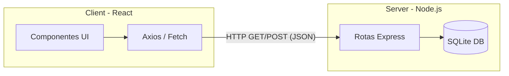

# Análise Arquitetural - ESM Forum

## A. Identificação da Arquitetura
O sistema segue o estilo arquitetural **Cliente-Servidor** focado em chamadas **API REST**.
- **Apresentação Frontend:** Uma SPA (Single Page Application) baseada em React.
- **Apresentação Backend (Controllers):** As rotas Express recebem payloads JSON e atuam como tradutores HTTP.
- **Camada de Negócio e Dados:** No projeto base, estas camadas estavam acopladas nas próprias rotas.
- A comunicação entre Frontend e Backend ocorre exclusivamente via requisições HTTP assíncronas utilizando o formato JSON.

## B. Diagrama Arquitetural Atual
