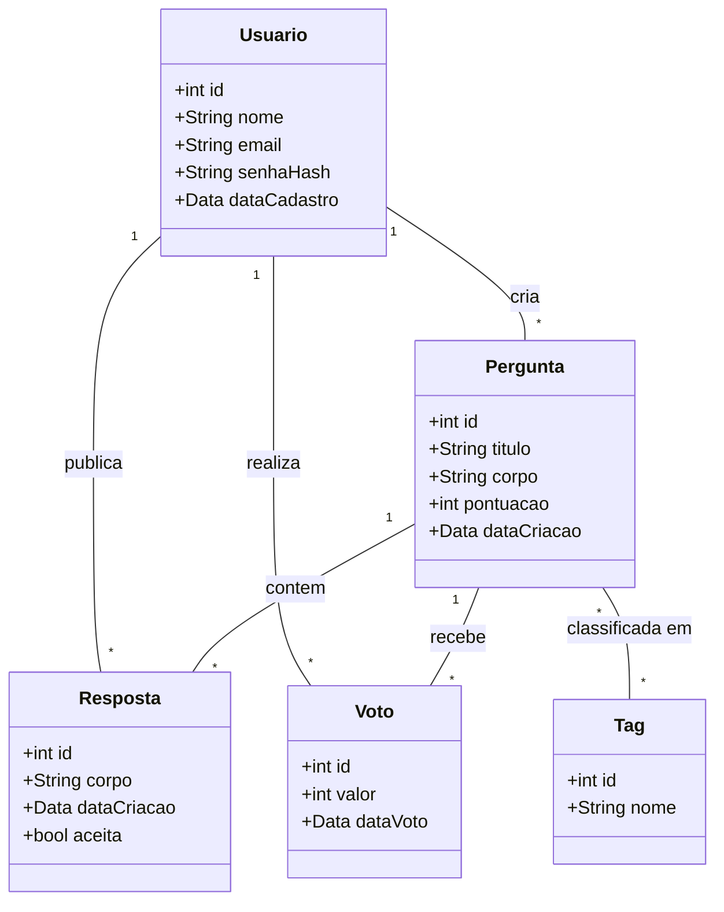
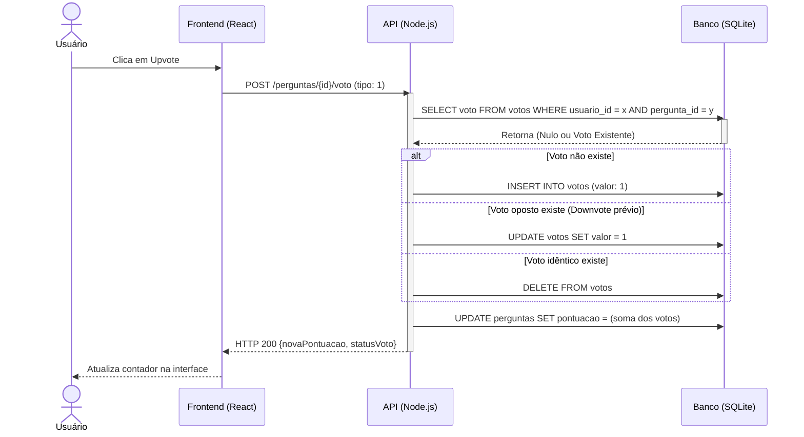
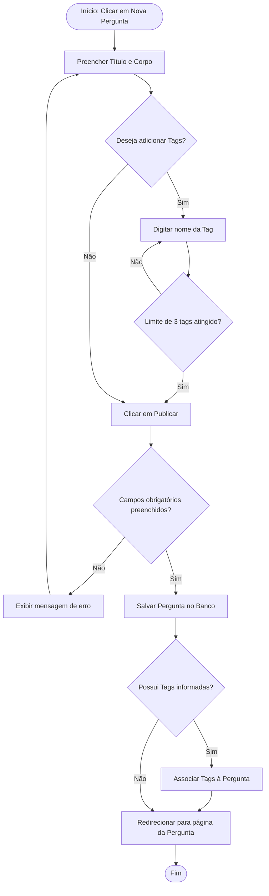
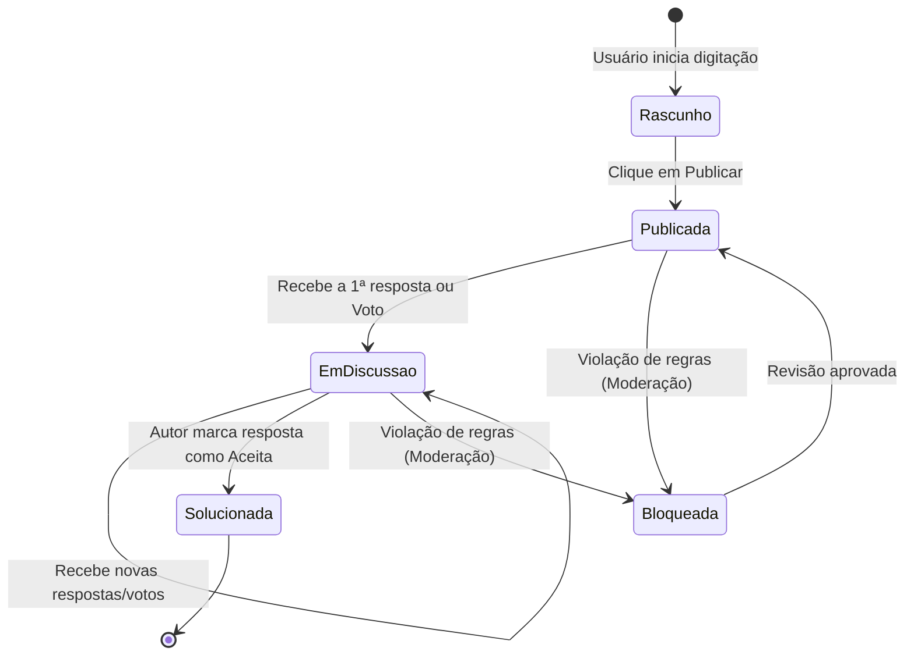

# Diagramas UML - ESM Forum

## A. Diagrama de Classes
*Representa a estrutura de dados e as associações entre entidades, contemplando as novas funcionalidades de Votação e Tags.*

## B. Diagrama de Sequência
*Modela a interação sistêmica correspondente ao Caso de Uso: Votar em Pergunta (Fluxo de Voto e Inversão).*

## C. Diagrama de Atividades
*Modela o fluxo lógico de publicação de uma pergunta incluindo a nova funcionalidade de Categorização (Tags).*

## D. Diagrama de Estados
*Modela o ciclo de vida e os estados possíveis do objeto principal do domínio: A Pergunta.*

