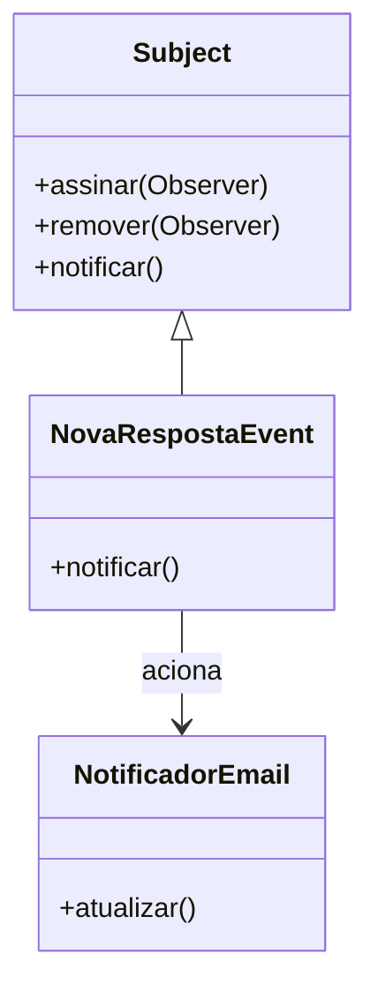
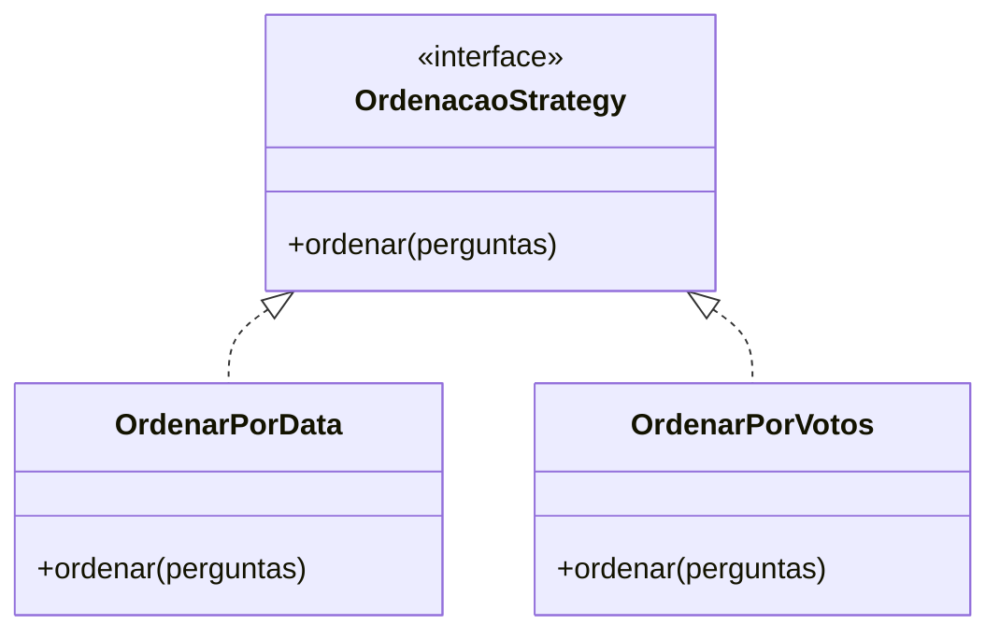
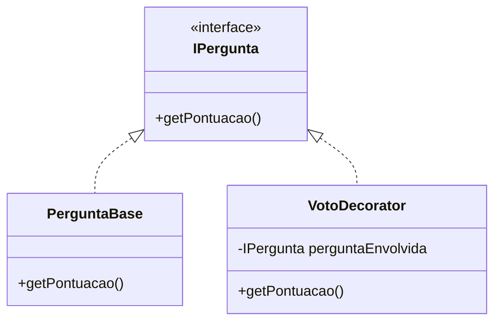

# Proposta de Aplicação de Padrões de Projeto

## 1. Padrão: Observer (Comportamental)
**A) Contexto:** Funcionalidade "Notificação de novas respostas".
**B) Proposta:** Quando uma nova resposta é criada, a classe `RespostaService` notifica os assinantes (Observer) interessados, desacoplando o ato de responder da lógica de envio de e-mails/notificações.
**C) Exemplo e Diagrama:**
```javascript
// Pseudo-código
class GerenciadorEventos {
    assinar(evento, callback) { ... }
    notificar(evento, dados) { ... }
}
// Na inicialização
eventos.assinar('NOVA_RESPOSTA', NotificadorEmail.enviar);
// No Service
eventos.notificar('NOVA_RESPOSTA', { autorId, perguntaId });
```


## 2. Padrão: Strategy (Comportamental)
**A) Contexto:** Filtragem e Ordenação da listagem principal de perguntas.
**B) Proposta:** Evitar múltiplos `if/else` no backend caso o usuário queira ordenar por "Mais Recentes", "Mais Votadas" ou "Sem Respostas". O Strategy isola cada algoritmo de ordenação em sua própria classe.
**C) Exemplo e Diagrama:**
```javascript
// Pseudo-código
class ContextoBusca {
    setEstrategia(estrategia) { this.estrategia = estrategia; }
    executar(perguntas) { return this.estrategia.ordenar(perguntas); }
}
```


## 3. Padrão: Decorator (Estrutural)
**A) Contexto:** Sistema de Votação (Upvote/Downvote)
**B) Proposta:** Em vez de alterar a classe base `Pergunta` adicionando lógica complexa de peso de votos de usuários especiais (ex: moderadores), o Decorator envolve a entidade base e calcula a pontuação dinâmica em tempo real.
**C) Diagrama:**
