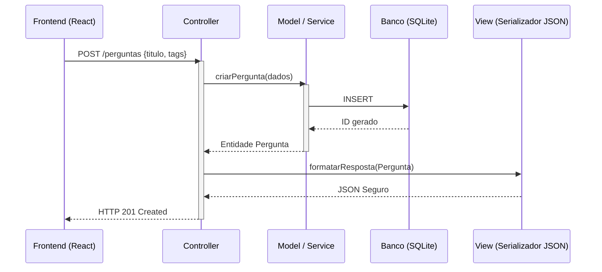

# Proposta de Organização Arquitetural

## A. Separação em Camadas Definidas

Para sustentar as novas funcionalidades (Votação, Tags), adotaremos a arquitetura **N-Tier (Camadas Limpas)**:

1. **Camada de Apresentação (Routes/Controllers):**
   * **Responsabilidade:** Receber tráfego HTTP, extrair headers/tokens, ler o `req.body` e retornar códigos HTTP (200, 400, 404).
   * **Exemplo:** `PerguntaController`. Não contém lógicas (ifs) de negócio.

2. **Camada de Negócio (Services/Use Cases):**
   * **Responsabilidade:** O coração do fórum. Valida se o usuário tem permissão para votar, confere limites de 3 tags por pergunta, e orquestra a lógica central independentemente de ser web ou mobile.
   * **Exemplo:** `RegistrarVotoService`, `CriarPerguntaService`.

3. **Camada de Dados (Repositories/DAOs):**
   * **Responsabilidade:** Única camada que conversa com o SQLite. Traduz objetos JS para queries SQL (`SELECT`, `INSERT`).
   * **Exemplo:** `UsuarioRepository`, `TagRepository`.

## B. Aplicação do Padrão MVC no Backend

Para o gerenciamento de **Perguntas** e **Tags**:

- **Model:** Classes ES6 de domínio puro (ex: `Pergunta.js`). Definem atributos e validam consistência interna de estado (título não pode ser vazio).
- **View:** No contexto de APIs REST, a View é representada por DTOs (Data Transfer Objects) ou funções de serialização, que "limpam" os dados (removendo senhas ou IDs internos) antes de enviá-los no `res.json()`.
- **Controller:** O maestro. O `PerguntaController` intercepta o `POST /perguntas`, aciona o `CriarPerguntaService` (que usa o Model) e passa o resultado para o DTO (View) responder.

### Diagrama MVC Proposto
